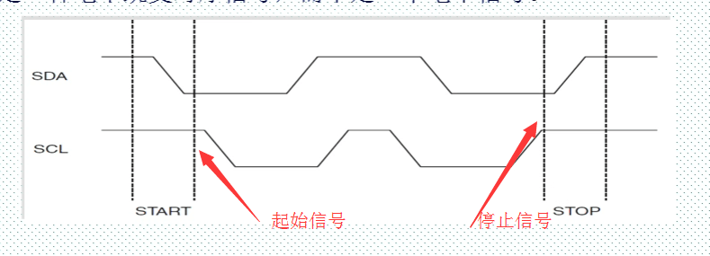
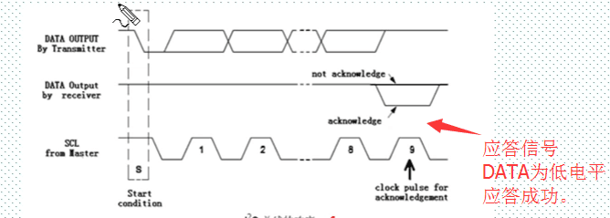
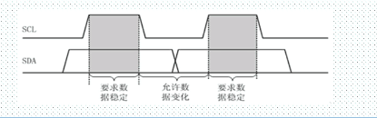

> # I2C协议
>-------------------------------------------------------
> **起始信号和停止信号**
> 
>
> **应答信号，DATA为低电平产生应答，反之没有应答成功。**
> 
>
> **数据读写1或读写0**
> 写1时先把SDA拉高，再来检查SCL是不是高
> 如果是读时就直接检查SCL时钟就可以了
> 
>
>
>
>
>
>
>
>
>
>
>
>
>
>
>
>
>